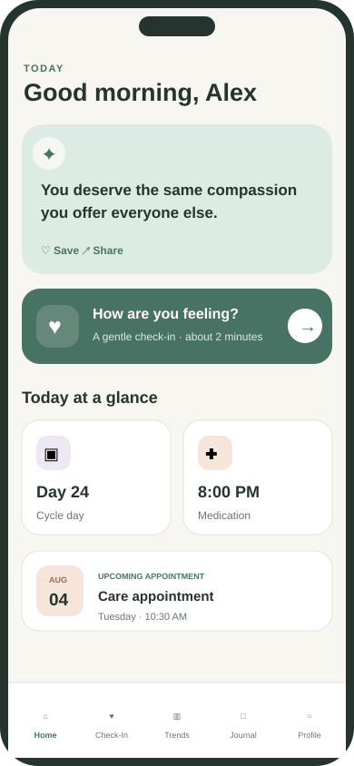
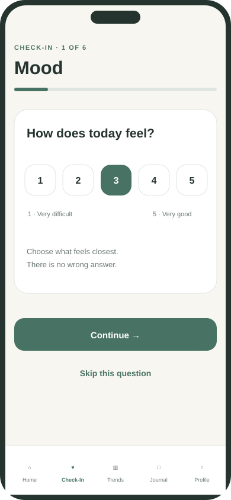
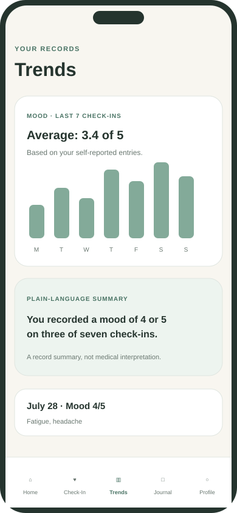
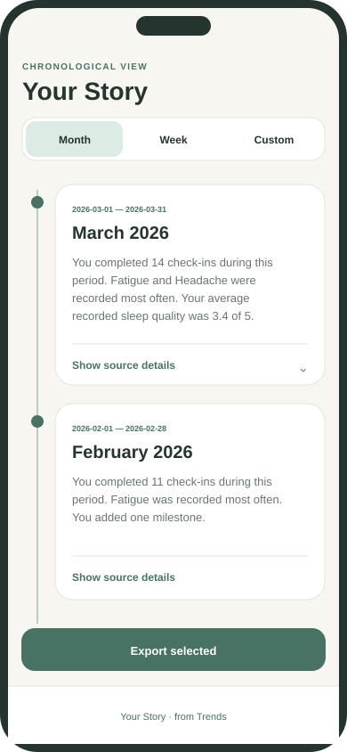

<div align="center">
  <div style="font-size: 3rem">♥</div>

# Symptom Story

**A calm, privacy-conscious health-history companion for people diagnosed with PMDD or postpartum depression.**

[](https://expo.dev/)
[](https://reactnative.dev/)
[](https://www.typescriptlang.org/)
[](https://supabase.com/)
[](marketing/accessibility.html)
[](LICENSE)

[Explore the marketing site](marketing/index.html) · [Security policy](SECURITY.md) · [Privacy & safety review](PRIVACY_AND_SAFETY_REVIEW.md) · [Contributing](CONTRIBUTING.md)

</div>

> [!IMPORTANT]
> Symptom Story is a pre-release portfolio project. It does **not** diagnose, screen for, predict, or treat any medical or mental health condition, and it is not a crisis service or a substitute for professional care. Do not use this build with real health information until the deployment has completed independent security, privacy, clinical, accessibility, and legal review.

## Why Symptom Story?

Important experiences can be difficult to remember and even harder to summarize during a short healthcare appointment. Symptom Story offers a quiet, low-effort place to record what happened—without turning personal entries into a diagnosis or treatment recommendation.

The product is guided by one question:

> **Can someone complete this in less than two minutes while they are not feeling their best?**

## Product preview

<table>
  <tr>
    <td align="center"><strong>Calm home</strong></td>
    <td align="center"><strong>Focused check-in</strong></td>
    <td align="center"><strong>Readable trends</strong></td>
  </tr>
  <tr>
    <td></td>
    <td></td>
    <td></td>
  </tr>
</table>

<p align="center"></p>

_The preview images are fictional design renders. They contain no real user or health information._

## Preview the product safely

Yes—this repository uses **Expo SDK 54 and React Native 0.81**. The iOS, Android, and browser builds share the same React Native application code. Expo Web uses Metro with static output configured in `app.json`; adding the browser preview does not replace either mobile target.

The fastest way to review the main onboarding, dashboard, and daily check-in experience is the built-in **fictional preview mode**. It does not create an account, contact Supabase, persist entries, or require environment variables.

```bash
npm install
npm run preview:web
```

Open **[http://localhost:8081](http://localhost:8081)** and click **Continue to preview**. You can then open **Start daily check-in**, complete the three-step preview, and return to the dashboard. A banner remains visible to identify fictional preview mode.

For Expo Go on a phone:

```bash
npm run preview:mobile
```

Scan the QR code with Expo Go. iOS and Android support remains unchanged; preview mode is only a build-time entry choice.

To verify the deployable output locally:

```bash
npm run build:preview
npm run preview:serve
```

Then open **[http://localhost:4174](http://localhost:4174)**.

### Vercel preview

`vercel.json` always runs `npm run build:preview`, so a public preview contains fictional in-memory screens only. It does not expose authentication, Supabase health tables, or provider secrets.

1. In Vercel, click **Add New → Project**.
2. Import the **Symptom-Story** repository.
3. Do not add Supabase or AI environment variables.
4. Click **Deploy**.
5. When the deployment finishes, click **Visit** to open the generated `https://<project>.vercel.app` URL.

No production Vercel URL is committed because deployment ownership and the final project name require repository-owner approval.

## Features

### Configure password reset

Set `EXPO_PUBLIC_PASSWORD_RESET_REDIRECT_URL` in your local environment and add the identical URL to **Supabase Dashboard → Authentication → URL Configuration → Redirect URLs**. Native development defaults to `symptomstory://reset-password`; hosted web builds should use an approved HTTPS callback URL. The forgot-password confirmation intentionally uses the same wording whether or not an account exists, which avoids exposing account membership.

### Available in the current prototype

- **Account access** — Supabase email/password registration, confirmation messaging, session restoration, sign-in, and sign-out.
- **Personal onboarding** — display name and PMDD or postpartum depression tracking preference.
- **Two-minute daily check-in** — six focused steps for mood, sleep, energy, symptoms, medication status, and optional reflection.
- **Personal trends** — charts derived from self-reported entries and paired with plain-language summaries.
- **Medication context** — add medications, record schedules, log a taken dose, and remove a medication.
- **Private journal** — create, read, and delete short reflections.
- **Data ownership tools** — export account records and delete the account with its associated primary-database records.
- **Support and Safety** — an always-reachable, static path toward immediate human support; no generative AI crisis response.
- **Optional AI appointment draft** — explicitly consent to create, review, edit, save, and share a bounded summary of check-ins, medication records, and questions.
- **Your Story timeline** — view deterministic monthly, weekly, or custom-range narratives; expand source details, add milestones, edit or hide summaries, and export only selected cards.
- **Responsive marketing site** — landing, Features, Privacy, Accessibility, FAQ, About, Contact, and Download pages.

### Deliberately outside the product boundary

Symptom Story does not diagnose PMDD or postpartum depression, evaluate whether someone has a condition, recommend medication or dosage changes, predict recovery, claim that treatment is working, or replace licensed care.

## Architecture

```mermaid
flowchart LR
    subgraph Client[Expo / React Native client]
      UI[Accessible mobile UI]
      API[Typed API helpers]
      Token[SecureStore\nnative sessions]
    end

    subgraph Supabase[Supabase project]
      Auth[Supabase Auth]
      REST[PostgREST API]
      DB[(PostgreSQL)]
      RLS[Row Level Security]
    end

    UI --> API
    API --> REST
    UI --> Auth
    Auth <--> Token
    REST --> RLS
    RLS --> DB
    Auth -. verified auth.uid() .-> RLS
```

### Data flow and trust boundaries

1. Supabase Auth issues and refreshes the authenticated session.
2. Native tokens are stored in OS-protected SecureStore; web uses a documented storage fallback.
3. The client requests only the active account's rows as defense in depth.
4. PostgreSQL RLS remains the authorization boundary and evaluates `auth.uid()` for every user-data operation.
5. Database constraints validate ranges, lengths, trimmed required text, and the symptom allowlist.
6. AI appointment summaries are opt-in: after explicit consent, selected check-ins, medication records, and user-entered questions are sent through a server function to the configured AI provider. Journal entries are excluded. No health content is sent to advertising or analytics services.

See [`SECURITY.md`](SECURITY.md) for the threat boundary, deployment checklist, vulnerability-reporting process, and known limitations.

## Technology stack

| Layer | Technology | Purpose |
| --- | --- | --- |
| Mobile | React Native + Expo Router | iOS, Android, and web app surface |
| Language | TypeScript | Strictly typed client and domain logic |
| Authentication | Supabase Auth | Account and session identity |
| Database | Supabase PostgreSQL | User-owned application records |
| Authorization | PostgreSQL RLS | Server-enforced row ownership |
| Native secrets | Expo SecureStore | OS-protected auth session storage |
| Web marketing | Semantic HTML, CSS, JavaScript | Dependency-free responsive website |
| Tests | Node test runner | Domain, security, migration, and website checks |

## Repository map

```text
app/                       Expo routes and application UI
src/api.ts                 Supabase data-access helpers
src/domain.ts              Pure domain and safety utilities
src/supabase.ts            Supabase client and session storage
supabase/migrations/       Schema, constraints, permissions, and RLS
marketing/                 Responsive static marketing website
docs/images/               Fictional portfolio preview renders
test/                      Domain, security, migration, and site tests
scripts/                   Repository checks
```

## Getting started

### Prerequisites

- Node.js 20 or newer
- npm
- Expo-compatible iOS Simulator, Android Emulator, or physical device
- A **non-production** Supabase project for development
- Supabase CLI or SQL Editor access for migrations

### 1. Clone and install

```bash
git clone <your-fork-or-repository-url>
cd Symptom-Story
npm install
```

### 2. Configure public client values

```bash
cp .env.example .env
```

Fill in:

```dotenv
EXPO_PUBLIC_SUPABASE_URL=https://your-project.supabase.co
EXPO_PUBLIC_SUPABASE_ANON_KEY=your-public-anon-key
```

`EXPO_PUBLIC_*` values are compiled into the client. The anonymous key is public configuration that relies on RLS; it is not a server secret. **Never** add a service-role key, database password, JWT signing secret, or private API key to the Expo environment.

### 3. Apply the database migrations

Apply every file in `supabase/migrations/` in filename order to the development project:

```text
202607280001_initial.sql
202607280002_security_hardening.sql
202607280003_appointment_summaries.sql
202607280004_your_story.sql
```

Before using any real deployment, run adversarial two-account RLS tests against the actual Supabase project. Static migration tests do not prove deployed policies are correct.

#### Optional AI appointment summaries

The rest of the app works without an AI provider. To enable the explicitly opt-in appointment-summary action, deploy `supabase/functions/appointment-summary` and configure these **server-only** Edge Function secrets:

```text
OPENAI_API_KEY=<server-only provider key>
OPENAI_MODEL=<approved model identifier>
APP_ORIGIN=<marketing or web-app origin>
```

Never add these to `.env`, use an `EXPO_PUBLIC_` prefix, or expose them to the mobile client. The function requests non-storage from the provider, excludes journal entries and profile identity, sends only owner-scoped check-ins, medications, and questions after disclosure acknowledgement, and returns an editable draft. Provider retention and contractual controls still require review; `store: false` is not a substitute for a data-processing agreement or privacy assessment.

### 4. Run the app

```bash
npm start          # Expo development menu
npm run ios        # iOS
npm run android    # Android
npm run web        # Expo web
npm run preview    # Fictional preview in the Expo development menu
npm run preview:web # Fictional browser preview
npm run preview:mobile # Fictional preview in Expo Go
```

### 5. Preview the marketing site

```bash
npm run marketing
# Open http://localhost:4173
```

The marketing site is static and requires no app credentials.

## Quality checks

```bash
npm run lint        # Inclusive-language repository scan
npm run typecheck   # Strict TypeScript validation
npm test            # Domain, migration, security, and marketing tests
npm run test:coverage # Enforce ≥80% lines, branches, and functions in core logic
npm run build:web   # Production Expo web export
```

Tests currently cover owner-scoped domain behavior, check-in CRUD primitives, medication and journal records, safety-language activation, user-only export and deletion, migration/RLS structure, protected native token storage, explicit API ownership filters, environment hygiene, required marketing pages, local links, responsive breakpoints, focus styling, and reduced motion.

### Testing strategy

| Layer | Scope | Examples |
| --- | --- | --- |
| Unit | Pure validation and reporting | Credentials, onboarding, check-in scales, symptom allowlist, medication input, objective summaries |
| Integration | Business operations across a repository boundary | Onboarding before writes, check-in upsert/delete, medication lifecycle, owner-isolated reads and reports |
| End to end | Headless core user journey | Authenticate input, onboard, record multiple check-ins, add medication, generate report, delete account |
| Security contract | Client and SQL structure | SecureStore, explicit owner filters, RLS, grants, cross-owner medication references, cascade deletion |
| Documentation | Website and repository integrity | Required pages, links, breakpoints, reduced motion, screenshots, and governance files |

The coverage command uses Node's native coverage engine and fails below **80% for lines, functions, or branches** in `src/core.ts`, `src/memoryRepository.ts`, and `src/yourStory.ts`. The current measured result is **100% lines, 100% functions, and 97.87% branches**. Headless tests validate core workflows; they do not replace device UI automation or live two-account Supabase tests, both of which remain on the roadmap.

## Accessibility statement

Accessibility is a product requirement, not a finishing pass. The current implementation includes:

- semantic headings, field labels, button roles, and selected/checked/disabled states;
- minimum 44-point touch targets and thumb-reachable primary actions;
- keyboard-aware form layouts and safe-area handling;
- plain-language alternatives for trend charts;
- live regions for success and error feedback;
- operating-system Reduce Motion support;
- visible keyboard focus and skip navigation on the marketing site;
- concise, optional questions with minimal typing.

Automated semantics cannot replace testing with people. Screen-reader, switch-control, voice-control, dynamic-text, contrast, cognitive-accessibility, and device testing remain required before release. Please report barriers using the process in [`CONTRIBUTING.md`](CONTRIBUTING.md) without including health information.

## Privacy philosophy

1. **Collect intentionally.** Ask only for information that supports a user-chosen record.
2. **Keep ownership enforceable.** Server-side RLS—not a client-supplied ID—defines record access.
3. **Avoid surveillance incentives.** No advertising SDK, health-data sale, or journal-to-LLM pipeline. Optional AI summaries disclose the selected data transfer before it occurs.
4. **Explain boundaries.** Export destinations, browser storage, backups, and connected services carry their own risk.
5. **Make leaving possible.** Provide export and account-deletion controls.
6. **Never overclaim.** This project does not claim HIPAA compliance.

Read the current [`Privacy and Safety Review`](PRIVACY_AND_SAFETY_REVIEW.md) before handling sensitive data.

## Roadmap

### Now — prototype stabilization

- [x] Mobile-first Expo experience
- [x] Supabase authentication and user-scoped records
- [x] Check-ins, journal, medications, trends, export, and deletion
- [x] RLS hardening and static security regression tests
- [x] Accessible responsive marketing site

### Next — validation

- [ ] Live two-account Supabase integration and adversarial RLS tests
- [ ] Automated mobile UI tests at common phone sizes
- [ ] Screen-reader, dynamic-type, keyboard, contrast, and reduced-motion audits
- [ ] Reviewed regional Support and Safety resource configuration
- [ ] Password recovery and verified deep-link flows
- [ ] Dependency audit, mobile penetration test, and web CSP review

### Later — release readiness

- [x] Optional, editable AI appointment-summary draft with explicit consent
- [x] Deterministic, editable Your Story timeline with milestones and selective export
- [ ] Clinician-reviewed deterministic health-summary format and PDF export
- [ ] Offline-first synchronization with conflict handling
- [ ] Notification preferences with gentle, non-guilt-based language
- [ ] Localization and region-aware safety content
- [ ] App Store and Play Store release pipeline
- [ ] Formal privacy, clinical, security, accessibility, and legal approval

Roadmap items are proposals, not commitments. Major architecture, clinical-boundary, and privacy decisions require review before implementation.

## Contributing

Thoughtful issues, accessibility feedback, security reports, documentation improvements, and focused pull requests are welcome. Please read [`CONTRIBUTING.md`](CONTRIBUTING.md) and follow the [`Code of Conduct`](CODE_OF_CONDUCT.md).

For security issues, use private vulnerability reporting as described in [`SECURITY.md`](SECURITY.md). Never place credentials, exploit details, or health information in a public issue.

## Documentation

- [MVP implementation status](MVP_AUDIT_REPORT.md)
- [Privacy and safety review](PRIVACY_AND_SAFETY_REVIEW.md)
- [Security policy](SECURITY.md)
- [Contribution guide](CONTRIBUTING.md)
- [Code of Conduct](CODE_OF_CONDUCT.md)
- [Marketing website](marketing/index.html)
- [Your Story deterministic logic](YOUR_STORY_LOGIC.md)

## License

Source code and documentation are available under the [MIT License](LICENSE). This license does not make the software suitable for clinical use and does not grant permission to claim medical, regulatory, security, privacy, or accessibility compliance.
